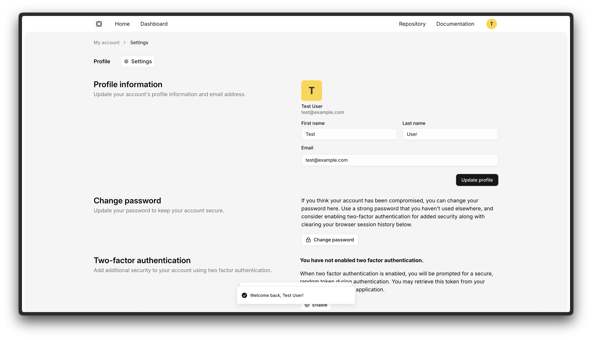

<p align="center"><a href="https://liraui.com/docs/auth/installation" target="_blank"></a></p>

# Auth package

Opinionated authentication package for Laravel, and React applications. This package provides a reusable auth layout and authentication screens: Login, Forgot password, Reset password, Email verification, Profile settings, etc.

> ⚠️ Beta: This project is in BETA — APIs, file layout, and packages may change. Use for prototyping and early development. Report bugs or breaking changes in issues, please.

## What this package provides

- Ready-to-use authentication screens and routes (login, register, forgot/reset password, email verification, profile settings)
- Server-side actions and controllers for common auth flows (register, authenticate, logout, password reset, email verification)
- Two-factor authentication support with enabling/disabling, recovery codes, and verification flows
- One-time access code (OTAC) utilities and stores for short-lived code workflows
- Extensible contracts and action classes so apps can replace behavior via interfaces
- Events, listeners and notifications wired for email verification, password reset, profile updates, and user deletion

## Quick start

Install the package with Composer:

```bash
composer require liraui/auth
```

For full installation instructions and documentation, visit the [Installation guide](https://liraui.com/docs/auth/installation).

## Contributing

Bug reports and contributions are welcome — please open an issue or a pull request. Maintain a short description of breaking changes.

## License

The auth package is open-sourced licensed under the MIT license.
